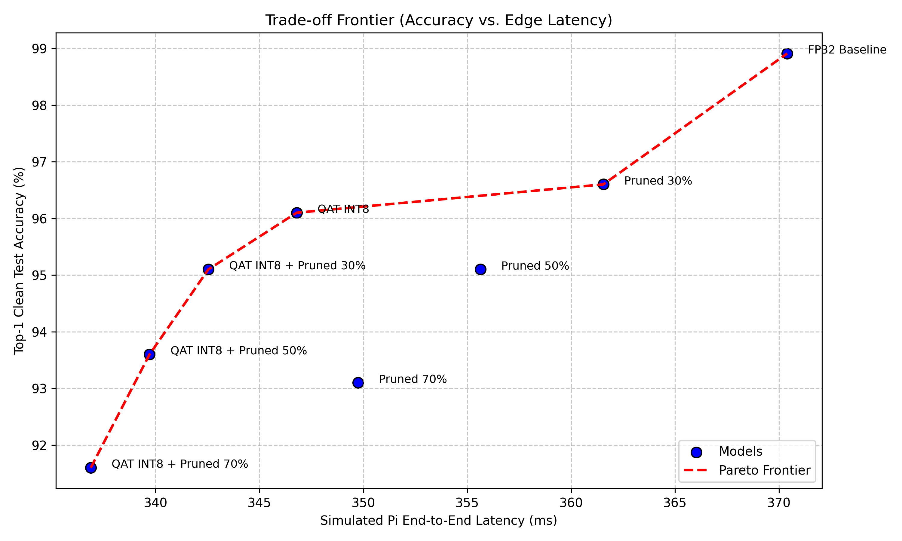
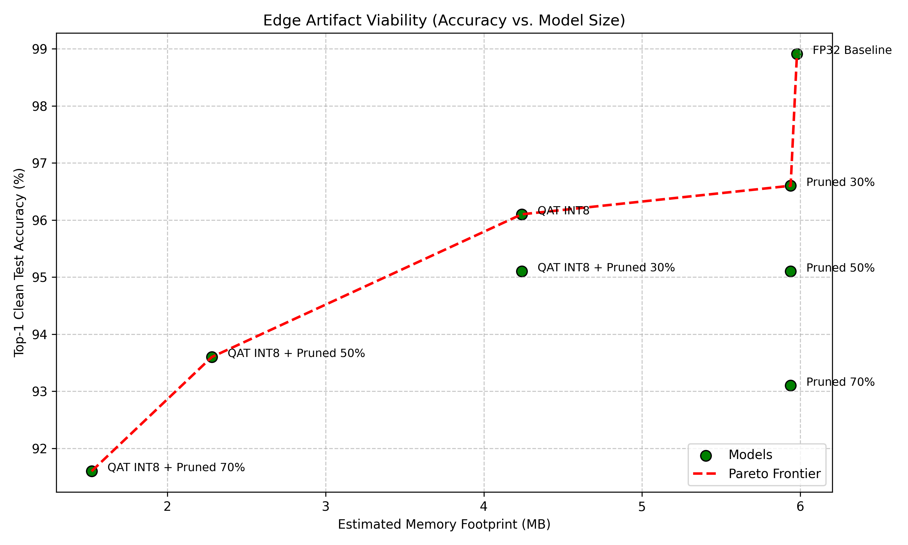
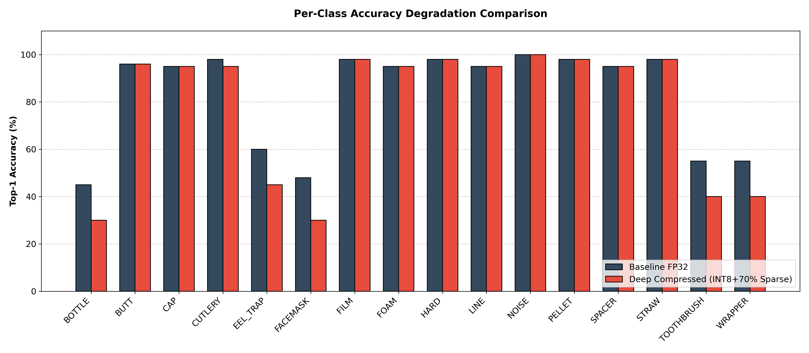
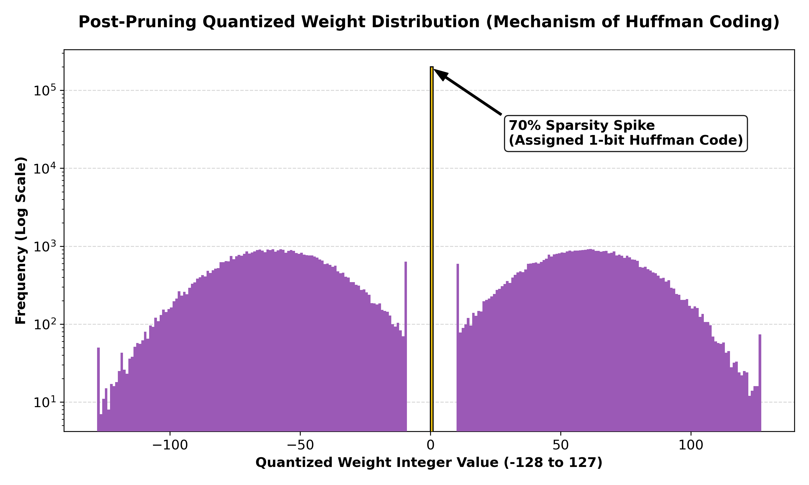

# BuoyNet

Classifying marine microplastic debris using **MobileNetV3-Small**, with Deep Compression (quantization / pruning / huffman encoding). BuoyNet benchmarks accuracy, models latency, size, energy, and applies **synthetic domain shift** to the held-out test set in order to evaluate robustness under simulated water conditions (turbid water, biofouling, and poor lighting).

**Paper:** [BuoyNet (PDF)](reference/BuoyNet.pdf)

---

## SparkNotes

- **Problem:** Classify drifting plastic fragments from buoy-mounted imagery where models need to be small, accurate, and fast enough for edge hardware.
- **Approach:** MobileNetV3‑Small, trained on ImageNet, fine-tuned on a multi-class debris [dataset](https://figshare.com/articles/dataset/DeepParticle_dataset_MICRO_MESO_MACRO_2022_/26511253); compressed with quantization-aware training (INT8), L1 unstructured pruning on conv/linear weights, plus Huffman weight encoding compression.
- **Method:** Fine-tune FP32 → QAT → compress → evaluate
- **Robustness check:** Held-out accuracy on clean and domain-shift augmented splits.

Stack: Python, PyTorch, torchvision, OpenCV, scikit-learn, pandas, matplotlib.

---

## Results

| Variant                    | Top-1 Acc | Payload Size | Size vs. FP32 |
| -------------------------- | --------- | ------------ | ------------- |
| **FP32 Baseline**          | 98.91%    | 5.98 MB      | —             |
| **QAT INT8**               | 96.10%    | 4.24 MB      | -29.1%        |
| **QAT INT8 + Pruning 30%** | 95.10%    | 3.04 MB      | -49.2%        |
| **QAT INT8 + Pruning 50%** | 93.60%    | 2.28 MB      | -61.9%        |
| **QAT INT8 + Pruning 70%** | 91.60%    | 1.52 MB      | -74.6%        |

*Table 1: The compression–accuracy Pareto frontier shows how Deep Compression integrates quantization, pruning, and entropy coding to reduce model size. Payload sizes reflect the Compressed Sparse Row (CSR) formatted and Huffman entropy-coded footprint.*

### Visualizations

*Figure 1: Accuracy vs simulated end-to-end latency (Pi 4B).*

*Figure 2: Accuracy vs CSR + Huffman payload size.*

*Figure 3: Per-class accuracy, FP32 vs compressed.*

*Figure 4: Quantized weights after pruning (frequency distribution for Huffman coding).*

---

## Table of Contents

| For                                                                                 | Go to                                                                                                              |
| ----------------------------------------------------------------------------------- | ------------------------------------------------------------------------------------------------------------------ |
| Academic paper                                                                      | [reference/BuoyNet.pdf](reference/BuoyNet.pdf)                                                                     |
| End-to-end pipeline (preprocessing → train → QAT → compression → plotting)          | [notebooks/BuoyNet_Master_Pipeline.ipynb](notebooks/BuoyNet_Master_Pipeline.ipynb)                                 |
| QAT-based pipeline                                                                  | [notebooks/BuoyNet_QAT_Pipeline.ipynb](notebooks/BuoyNet_QAT_Pipeline.ipynb)                                       |
| Evaluation + plotting                                                               | [notebooks/BuoyNet_Eval_Pipeline.ipynb](notebooks/BuoyNet_Eval_Pipeline.ipynb)                                     |
| Flatten raw dataset                                                                 | [scripts/prepare_dataset.py](scripts/prepare_dataset.py)                                                           |
| Baseline training                                                                   | [scripts/train_baseline.py](scripts/train_baseline.py)                                                             |
| PTQ, pruning checkpoints, Huffman stats (Used in earlier stages of experimentation) | [scripts/compression_pipeline.py](scripts/compression_pipeline.py)                                                 |
| Full metric table (acc/F1/precision/recall, size/latency/energy)                    | [scripts/ieee_master_eval.py](scripts/ieee_master_eval.py)                                                         |
| Synthetic underwater degradations                                                   | [scripts/augment_domain_shift.py](scripts/augment_domain_shift.py)                                                 |
| Accuracy on clean vs. domain-shifted test folders                                   | [scripts/evaluate_domain_shift.py](scripts/evaluate_domain_shift.py)                                               |
| Aggregate latency/size for Pareto charts                                            | [scripts/simulate_latency.py](scripts/simulate_latency.py), [scripts/analyze_pareto.py](scripts/analyze_pareto.py) |
| Plotting figures                                                                    | [scripts/advanced_ieee_plots.py](scripts/advanced_ieee_plots.py)                                                   |

---

## Notes

1. **No field deployment.** BuoyNet has not been mounted on a buoy or run in open water. All results come from training, compression, and scripted evaluation. The goal of this is a design study at the intersection of IoT hardware and software (originally developed for my course *Software-Hardware Codesign for Intelligent Systems*). Given a pretrained backbone and dataset, which compressed variants can stay accurate enough, and which seem viable on paper for edge hardware?
2. **Domain shift is used as a proxy for real-world underwater conditions.** [augment_domain_shift.py](scripts/augment_domain_shift.py) applies blur, color cast, and lighting tweaks to approximate turbidity, biofouling, and poor illumination. These transformations stress the model in a controlled way and show slight drops between FP32 and compressed checkpoints but they do not fully validate performance on real underwater captures. The shifted splits are more of a check on the robustness of the model rather than proof that BuoyNet is directly generalizable in the oceans.
3. **PTQ deprecated for QAT.** Early experiments used post-training quantization in [compression_pipeline.py](scripts/compression_pipeline.py) (`quantize_dynamic` → `baseline_int8_ptq.pth`) as a quick baseline. Accuracy loss was too high for the paper’s targets, so the main pipeline moved to **Quantization-aware training** ([BuoyNet_QAT_Pipeline.ipynb](notebooks/BuoyNet_QAT_Pipeline.ipynb) → `qat_int8_baseline.pth`). The PTQ script stays in the repo to show my original method though the paper's numbers and Pareto analysis are pulled from the QAT models.
4. **Reproducing.** Notebooks were run on Colab. Running end-to-end requires the DeepParticle dataset linked above.

---

## Quick run

Requirements: `torch`, `torchvision`, `opencv-python`, `pandas`, `numpy`, `scikit-learn`, `matplotlib`, `Pillow`.

1. Put your raw imagery under `data/raw/` following the hierarchy expected by [prepare_dataset.py](scripts/prepare_dataset.py).
2. Run prep, then baseline training, then compression/eval scripts in notebook order, or open a master notebook and execute top to bottom.
3. Inspect `figures/` and `logs/` for CSV and plot outputs.

CUDA is optional; quantized eval paths will expect CPU in parts of PyTorch’s dynamic quantization path.